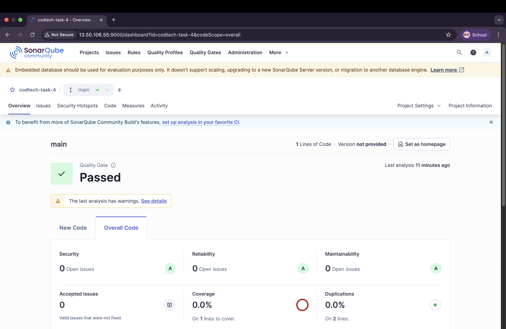

# CODTECH-TASK-4  
# SECURE DEVOPS USING SONARQUBE  

**COMPANY**: CODTECH IT SOLUTIONS  
**NAME**: OMKAR RAJENDRA PATIL  
**INTERN ID**: CT08DM1418  
**DOMAIN**: DevOps  
**DURATION**: 8 WEEKS  
**MENTOR**: NEELA SANTOSH KUMAR  

---

## DESCRIPTION OF TASK

In this task, I implemented Secure DevOps by integrating **SonarQube** for static code analysis. I deployed a SonarQube server using Docker on my AWS EC2 instance and accessed it via port 9000. I created a project named `codtech-task-4` and generated a secure token to authorize scans using the SonarScanner CLI.

I configured my project using `sonar-project.properties`, added a sample JavaScript file, and ran a code scan using SonarScanner. The results were displayed in the SonarQube dashboard, including metrics like bugs, code smells, and vulnerabilities. This integration demonstrates a key DevSecOps principle: identifying issues early in the pipeline before deployment.

---

## OUTPUT

- ✅ SonarQube running on EC2 (`http://<your-ec2-ip>:9000`)
- ✅ Project `codtech-task-4` created
- ✅ Token generated and used in scanner
- ✅ Code successfully scanned and uploaded
- ✅ Results visible in SonarQube dashboard

---

## FILES INCLUDED

- `sonar-project.properties` — Configuration for scanner  
- `src/index.js` — Sample source file  
- `assets/` — Proof screenshots

---

## 📸 SCREENSHOTS

> These images are stored in the `assets/` folder

### 🔹 SonarQube Dashboard Overview  


### 🔹 Code Analysis Overview  


### 🔹 CLI Output — Scanner Start  


### 🔹 CLI Output — Execution Success  


---
## HOW TO RUN

1. Run SonarQube server:
    ```bash
    docker run -d --name sonarqube -p 9000:9000 sonarqube
    ```

2. Access SonarQube at:
    ```bash
    http://<your-ec2-ip>:9000

    ```

3. Create sonar-project.properties file:
    ```
    vi sonar-project.properties
    sonar.projectKey=codtech-task-4
    sonar.host.url=http://<your-ec2-ip>:9000
    sonar.login=<your-token>

    ```

4. Run the scan:
    ```bash
    sonar-scanner

    ```
